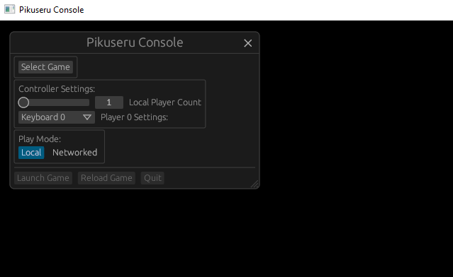
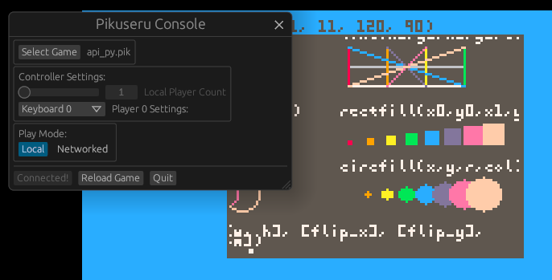
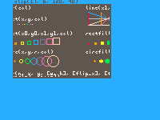
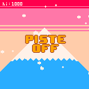
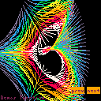
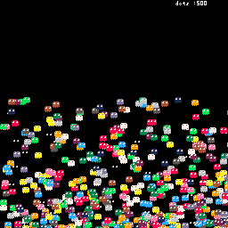

<!-- PROJECT BADGES -->
<!--
*** I'm using markdown "reference style" links for readability.
*** Reference links are enclosed in brackets [ ] instead of parentheses ( ).
*** See the bottom of this document for the declaration of the reference variables
*** for contributors-url, forks-url, etc. This is an optional, concise syntax you may use.
*** https://www.markdownguide.org/basic-syntax/#reference-style-links
-->
[![Github Link][github badge]][github link]
[![CI Status][ci badge]][ci link]

<!-- PROJECT LOGO -->
<p align="center">
  
</p>

<!-- ABOUT THE PROJECT -->
# Pikuseru Console 

[](https://github.com/PikuseruConsole/pikuseru-console/blob/master/LICENSE.md)

 
## Examples





A [demo API](https://github.com/PikuseruConsole/pikuseru-examples/tree/master/demos/API/api_py.pik) cartridge:



Some classic 128x128 game:





A 128x128 [demoscene](https://github.com/PikuseruConsole/pikuseru-examples/tree/master/demoscene/demoscene.pik) cartridge:




A 256x256 [ghostmark python](https://github.com/PikuseruConsole/pikuseru-examples/tree/master/ghostmark/ghostmark_py.pik) or a [ghostmark wasm/rust](https://github.com/PikuseruConsole/pikuseru-examples/tree/master/ghostmark/wasm/ghostmark/rust) cartridge to do some benchmark:



A [sand game](https://github.com/PikuseruConsole/Sable) with a custom window (286x286) in WASM (RUST):


## Build

Cargo feature:
  * cpython: enable python support
  * rlua: enable lua support

You can build the console directly the main UI to play games:
```
cd pikuseru-console
cargo build --release --features=pikuseru/cpython,pikuseru/rlua,pikuseru/image
```

## Usage

  * F1: enable the menu
  * F2: display debug information

[github badge]: https://img.shields.io/badge/github-pikuseruconsole/pikuseruconsole-8da0cb?style=for-the-badge&logo=github
[github link]: https://github.com/PikuseruConsole/pikuseru-console
[ci link]: https://github.com/PikuseruConsole/pikuseru-console/actions
[ci badge]: https://img.shields.io/github/actions/workflow/status/PikuseruConsole/pikuseru-console/rust.yml?branch=main&style=for-the-badge&logo=github-actions&logoColor=white
